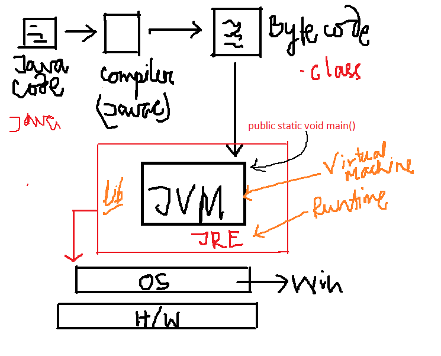
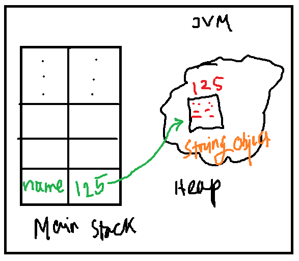
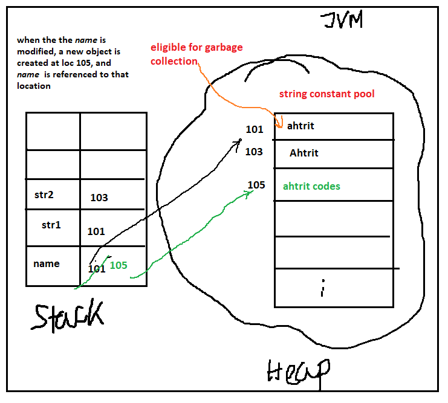
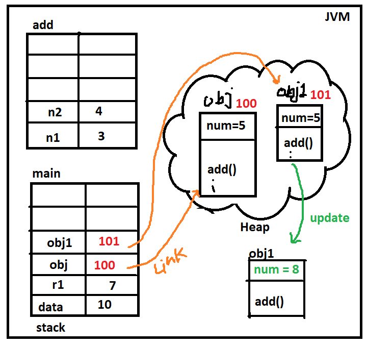
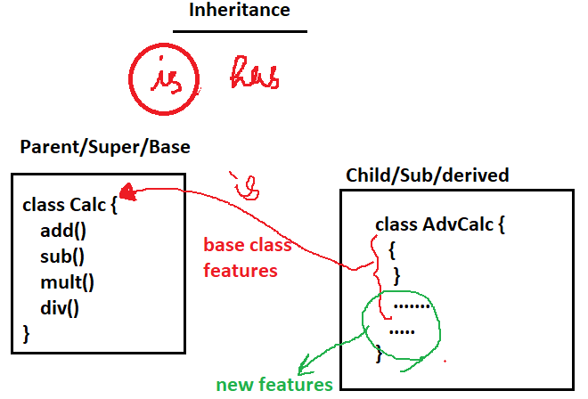
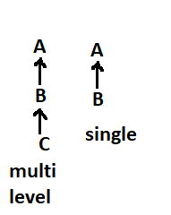
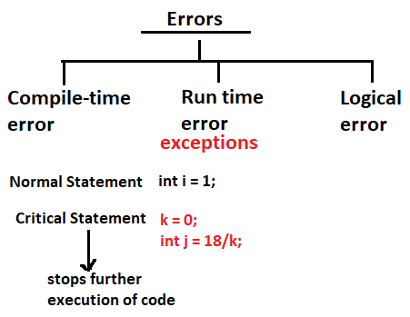
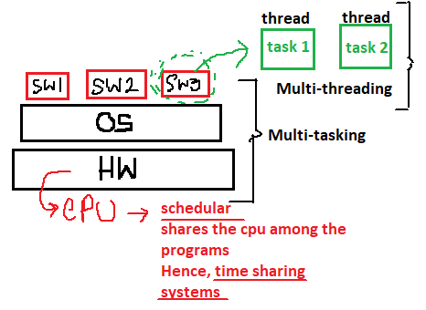

# Notes for Object Oriented Programming using Java (Semester - V)

# Introduction to Java

> "Write Once, Run Everywhere"

- Sun Microsystems, @1995
- Simple, Portable, secure, robust
- Java Virtual Machine (JVM) ensures that the compiled java code can run on different operating systems using the OS specific APIs
- strongly typed language

# Java Development



# Classes

- java.util.Scanner
- javax.swing.JOptionPane
- java.util.Random
- java.util.ArrayList
- java.lang.Math

# Built-in Functions

- .isBlank()
- .println()
- .print()
- .parseInt()

# GUI program

```java
import javax.swing.JOptionPane;

public class Main {
    public static void main(String[] args) {

        String name = JOptionPane.showInputDialog("Enter your name ? ");
        JOptionPane.showMessageDialog(null, "Hello "+name);

        int age = Integer.parseInt(JOptionPane.showInputDialog("Enter your age ? "));
        JOptionPane.showMessageDialog(null, "You are "+age+" years old");

        double height = Double.parseDouble(JOptionPane.showInputDialog("Enter your height ? ");)
        JOptionPane.showMessageDialog(null, "You are "+height+" cm tall");
    }
}
```

---

# Basic Concepts

## type conversion and casting

converting type of one variable to another type explicitly or implicitly

- narrowing
- widening / promotion

```java
public class Main {
    public static void main(String[] args) {

        byte b = 127;
        int a = 256;
        byte k = (byte) a; // perform a modulus operation

        float f = 5.6f;
        // int t = f;  // error
        int t = (int) f;

        // type promotion
        byte a = 10;
        byte b = 30;

        int res = a * b;

        // System.out.println(b);
    }
}
```

## arrays

here arrays have to be of similar data types, mixed values can't be used inside an array

```java
public class Main {
    public static void main(String[] args) {

        // String[] langs = {"C", "C++", "JavaScript", "PHP"};

        // System.out.println(langs[2]);
        // langs[2] = "NodeJs";
        // System.out.println(langs[2]);

        int[] nums = new int[4];
        nums[0] = 1;
        nums[1] = 2;
        nums[2] = 3;
        nums[3] = 4;

        for(int i=0; i<nums.length; i++) {
            System.out.println(nums[i]);
        }
    }
}

```

## 2D arrays

```java
public class Main {
    public static void main(String[] args) {
        // String[][] langs = new String[3][3];

        String[][] langs = {
            {"language", "usage", "framework"},
            {"JavaScript", "web", "express"},
            {"PHP", "web", "laravel"},
            {"Python", "web", "django"}
        };

        for(int i=0; i<langs.length; i++) {
            for(int j=0; j<langs[i].length; j++) {
                System.out.print(langs[i][j]+" ");
            }
            System.out.println();
        }
    }
}

```

## jagged arrays

explicitly mentioning the # columns of a 2D array is optional and thus results a jaaged array

```java
public class Main {
    public static void main(String[] args) {

        int nums[][] = new int[3][];    // jagged array

        nums[0] = new int[3];
        nums[1] = new int[3];
        nums[2] = new int[2];

        for(int i=0; i<nums.length; i++) {
            for(int j=0; j<nums[i].length; j++) {
                nums[i][j] = (int)(Math.random() * 10);
            }
        }

        for(int n[] : nums) {
            for(int m: n) {
                System.out.print(m + " ");
            }
            System.out.println();
        }
    }
}
```

### drawbacks of array

1. don't support mixed type values
2. can't resize during execution
3. operations are expensive

> solution => _collections_

## Math class

```java
import java.lang.Math;
public class Main {
    public static void main(String[] args) {
        double x = 5;   // declaration and initialization of variable
        double y;   // simple declaration
        y = Math.sqrt(5);
        System.out.printf("The square root of %.2f is %.3f\n",x, y);
    }
}
```

## Strings

string is basically a set of multiple characters

_a_ , _b_, .. => characters

ahtrit, coding, java => strings

- it is a class in java

```java
public class Main {
    public static void main(String[] args) {

        // String name = new String();     // String object
        String name = "ahtrit";

        String str1 = "ahtrit";
        String str2 = "Ahtrit";

        name = name + " codes";

        System.out.println(name);       // blank
    }
}
```



### String methods

- **.equals()** => compares two strings case sensitively
- **.equalsIgnore()** => compares two strings case insensitively
- **.length()** => returns length of the string
- **.charAt(index)** => return the character at the given index
- **.indexOf(ch)** => return the index of the character
- **.isEmpty()** => check if string is empty
- **.toUpperCase()** => all upper case
- **.toLowerCase()** => all lower case
- **.trim()** => removes empty spaces before and after the string
- **.replace(old, new)** => replace the old char of the string with new char

### string constant pool

a storage area in heap that keeps track of string created and ensures no duplicate strings are created multiple times

if any string is already present in the pool, the string variable is reference with the memory location of the string value

### mutable strings

- **String Buffer**

  - capacity is 21 as it gives the buffer to expand the data
  - thread sage

- **String Builder**
  - thread unsafe

```java
public class Main {
    public static void main(String[] args) {

        StringBuffer sb = new StringBuffer("ahtrit");

        // System.out.println(sb.capacity());

        sb.append(" codes");
        sb.deleteCharAt(2);

        String str = sb.toString();
    }
}
```



## wrapper class

provides a way to use primitive data types as reference data types containing useful methods
can be used with collections

eg.
boolean => Boolean
Character => Character
int => Integer
double => Double

- autoboxing
  the automatic conversion that Java compiler makes between the primitive data type and their corresponding wrapper class

- unboxing
  the reverse of autoboxing.
  Automatic conversion of wrapper class to primitive data types

```java
public class Main {
    public static void main(String[] args) {
        Boolean a = true;
        Character b = '#';
        Integer c = 23;
        Double d = 22.7;
        String e = "ahtrit";

        if(a==true) {
            System.out.println("true");

            // ☝ this code works due to unboxing feature of wrapper class which converts the variable 'a' to its primitive data type
        }

    }
}
```

## ArrayList

a resizable / dynamic array
like vector in C++
elements can be added and removed after compilation phase and store reference data types

### methods

- set()
- remove()
- clear()

```java

import java.util.ArrayList;
public class Main {
    public static void main(String[] args) {

        ArrayList<Integer> nums = new ArrayList<Integer>();
        nums.add(1);
        nums.add(2);
        nums.add(4);

        nums.set(1, 10);
        nums.remove(2);
        nums.clear();

        for(int i=0; i<nums.size(); i++) {
            System.out.println(nums.get(i));
        }
    }
}

```

## 2D ArrayList

a dynamic list of lists

```java
public class Main {
    public static void main(String[] args) {

        ArrayList<String> CS = new ArrayList();

        ArrayList<String> fields = new ArrayList();
        fields.add("web");
        fields.add("app");
        fields.add("ML");
        fields.add("statistics");

        ArrayList<String> languages = new ArrayList();
        languages.add("JavaScript");
        languages.add("Python");
        languages.add("Golang");

        ArrayList<String> frameworks = new ArrayList();
        frameworks.add("Nextjs");
        frameworks.add("Django");
        frameworks.add("Matplotlib");
        frameworks.add("OpenCV");

        CS.add(fields);
        CS.add(languages);
        CS.add(frameworks);

    }
}

```

## for-each loop

traversing technique to iterate through all the elements in an array / collection
less steps, more readable
less flexible

```java
public class Main {
    public static void main(String[] args) {

        int[] nums = {1, 2, 3, 4, 5, 6};

        for(int i : nums) {
            // statements
        }
    }
}

```

## methods

a block of code that is executed whenever it is called upon

- public
  it declares the method as unprotected i.e. the method can be accessed by any class

- static
  it ensures that the method declared in the class don't belong to any particular object or other method and can be accessed from anywhere in the class

- void / int ..
  denotes the return type of the method

- parameters
  methods may take some values as input from the calling construct in the class known as arguments.

```java
public class Main {
    public static void main(String[] args) {

        int x = 3;
        int y = 5;

        System.out.println(add(x, y));
    }

    static int add(int x, int y) {
        return (x+y);
    }
}

```

## overloaded methods

methods that share the same name but have different parametes
method name + params = method signature

```java
public class Main {
    public static void main(String[] args) {

        int x = 3;
        int y = 5;

        System.out.println(add(x, y));
    }

    static int add(int a, int b) {
        return a+b;
    }
    static int add(int a, int b, int c) {
        return a+b+c;
    }
    static int add(int a, int b, int c, double d) {
        return a+b+c+d;
    }
}

```

## printf

an optional method to control, format and display text to the console window (standard output)
two arguments = format string + (object/variable/value)

- % [flags] [precision] [width] [conversion-character]

```java
public class Main {
    public static void main(String[] args) {

        System.out.printf("This is a format string with value %d", 123);

    }
}

```

## final

> constant in java

anything declared as **final** can't be modified / updated later just like constant value

```java
public class Main {
    public static void main(String[] args) {

        final double PI = 3.14;

        PI = 22/7; // gives an error
    }
}

```

# OBJECT ORIENTED PROGRAMMING

## objects and classes

**_class_**

it acts as a blueprint based on which the objects will be instantiated by the JVM

an instance of a class that may contain attributes and method
eg: (person, phone, desk)

- person
  name:
  age:
  work:
  dob:
  ..

> Car.java

```java
public class Car {
    String make = "Tesla";
    String model = "Model S";
    int year = 2003;
    String color = "red";
    double price = 50000.00;

    void drive() {
        System.out.println("Driving...");
    }

    void brake() {
        System.out.println("Brakes applied...");
    }

}

```

> Main.java

```java
public class Main {
    public static void main(String[] args) {

        Car myCar = new Car();

        System.out.println(myCar.make);
        System.out.println(myCar.model);

        myCar.drive();
        myCar.brake();
    }
}

```

## stacks & heap

- for every class in a java program new memory stack is allocated
- new objects are created inside the heap memory with the instance variables (e.g => **_num_**)
- local variables are part of the stack
- however the definition of the class, methods & variables are in heap
- the definition and action what performed on the object (calling, executing, updating) are stored in the main and the execution of the code starts from main stack

```java
public class Calculator {
    public int num = 5;

    public int add(int n1, int n2) {
        System.out.println(num);
        return n1+n2;
    }
}
public class Main {
    public static void main(String[] args) {

        int data = 10;

        Calculator obj = new Calculator();
        Calculator obj1 = new Calculator();
        int r1 = obj.add(3, 4);

        obj1.num = 8;

        System.out.println(r1);         // 7
        System.out.println(obj.num);    // 5
        System.out.println(obj1.num);   // 8
    }
}
```



## constructors

special method that is called when an object is instantiated
gives ability to create different objects of same class using variable arguments

every time a new object is created the **constructor** is called

```java

public class Person {

    String name;
    int age;
    double weight;

    Person(String name, int age, double weight) {
        this.name = name;
        this.age = age;
        this.weight = weight;
    }

    void eat() {
        System.out.println(this.name + " is eating");
    }

    void drink() {
        System.out.println(this.name + " is drinking");
    }
}

public class Main {
    public static void main(String[] args) {

        Person p1 = new Person("ahtrit", 21, 66.3);
        Person p2 = new Person("codes", 20, 69.2);

        p1.eat();
        p2.drink();
    }
}

```

## variable scope

- **local**
  declared inside a block of code that may be a method, object or conditional blocks
- **global**
  declared outside of a method, but within a class and is visible and accessible to all parts of the class

```java

public class DiceRoller {

    Random random = new Random();
    int number;

    DiceRoller() {
        roll();
    }

    void roll() {
        number = random.nextInt(6)+1;
        System.out.println(number);
    }
}

public class Main {
    public static void main(String[] args) {

    }
}
```

## overloaded constructors

multiple constructors within a class with the same name, but have different parameters
name + parameters = signature

```java

public class Pizza {

    String bread;
    String sauce;
    String cheese;
    String toppings;

    Pizza(String bread, String sauce, String cheese, String topping) {
        this.bread = bread;
        this.sauce = sauce;
        this.cheese = cheese;
        this.topping = topping;
    }

    Pizza(String bread, String sauce, String cheese) {
        this.bread = bread;
        this.sauce = sauce;
        this.cheese = cheese;
    }

    Pizza(String bread, String sauce) {
        this.bread = bread;
        this.sauce = sauce;
    }

    Pizza(String bread) {
        this.bread = bread;
    }
}

public class Main {
    public static void main(String[] args) {

        Pizza pizza1 = new Pizza("thicc crust", "tomato", "mozzerella", "paneer");
        Pizza pizza2 = new Pizza("thicc crust", "tomato", "mozzerella");
        Pizza pizza3 = new Pizza("thicc crust", "tomato");
        Pizza pizza4 = new Pizza("thicc crust");
    }
}
```

## toString()

special method that all objects inherit, and returns a string that **textually represents** an object
can be used both implicitly and explicitly

```java

public class Car {
    String make = "Ford";
    String model = "Mustang";
    String color = "red";
    int year = 2021;

    // toString() method overriding
    public String toString() {

        String myString = make + " " + model + " " + color + " " + year;
        return myString;
    }
}

public class Main {
    public static void main(String[] args) {

        Car myCar = new Car();

        System.out.println(myCar);
    }
}
```

## array of objects

```java

public class Food {

    String name;

    Food(String name) {
        this.name = name;
    }
}

public class Main {
    public static void main(String[] args) {

        // int[] numbes = new int[3];

        // Food[] foods = new Food[3];

        Food food1 = new Food("pizza");
        Food food2 = new Food("burger");
        Food food3 = new Food("doi");

        Food[] foods = {food1, food2, food3};

        System.out.println(foods[0].name);
        System.out.println(foods[1].name);
        System.out.println(foods[2].name);
    }
}
```

## objects as arguments

```java

public class Garage {

    void park(Car car) {
        System.out.println("The "+car.name+" is parked");
    }
}

public class Car {

    String name;

    Car(String name) {
        this.name = name;
    }
}

public class Main {
    public static void main(String[] args) {

        Garage garage = new Garage();

        Car car1 = new Car("BMW");
        Car car2 = new Car("Tesla");

        garage.park(car1);
        garage.park(car2);
    }
}
```

## static

modifier.
A single copy of variable/method is created and shared.
The class _owns_ the static member

- static variables = **class variables**
- static methods = **class methods**

```java

public class Friend {

    String name;
    static int numberOfFriends;

    Friend(String name) {
        this.name = name;
        numberOfFriends++;
    }

    static void display() {
        System.out.println("You have "+numberOfFriends+" friends");
    }
}

public class Main {
    public static void main(String[] args) {

        Friend f1 = new Friend("ahtrit");
        Friend f2 = new Friend("codes");
        Friend f3 = new Friend("javascript");
        Friend f4 = new Friend("markdown");

        Friend.display();
    }
}
```

- static blocks are called when a class loads
  two step process

  1.  class loads
  2.  object instantiated

  if main() contains code to create object, the class loads along with the static block and the variable with value is stored in the heap

  the objects now instantiated gets the static variable value as well as the **_constructor_** method is called for each objects

```java
public class Mobile {

    static String name;

    static {
        name = "SmartPhone";
        System.out.println("in static block");
    }

    Mobile(String brand, int price) {
        brand = brand;
        price = price;
        System.out.println("in constructor");
    }

    public void show() {
        System.out.println(brand+" : "+price+" : "+name);
    }
}

public class Main {
    public static void main(String[] args) {

        Mobile obj1 = new Mobile("Apple", 2200);
        Mobile obj2 = new Mobile("Galaxy", 2000);

        obj1.show();
        obj2.show();
    }
}
```

## inheritance

the process by which one class acquires the attributes and methods of another class
a child class is the one which inherits the properties
a parent class is the one whose attributes are inherited
to inherit the properties the child class is extended to use parent class using the keyword _extends_



- Single
- Multilevel
- Multiple

> Java doesn't support multiple inheritance



```java

public class Vehicle {

    double speed;

    void go() {
        System.out.println("Moving...");
    }

    void stop() {
        System.out.println("Stopping...");
    }
}

public class Car extends Vehicle {

    String name;
    int wheels = 4;
    int doors = 4;

    Car(String name) {
        this.name = name;
    }
}

public class Bicycle extends Vehicle {

    String name;
    int wheels = 2;
    int pedals = 2;

    Car(String name) {
        this.name = name;
    }
}

public class Main {
    public static void main(String[] args) {

        Car car1 = new Car("BMW");
        Car car2 = new Car("Tesla");

        Bicycle bike1 = new Bicycle("Motor");

        car1.go();
        bike1.go();
    }
}
```

## method overriding

declaring a method in a sub class which is already present in parent class so that a child class can give its own implementation

```java
public class Animal {

    void speak() {
        System.out.println("Animal speaks");
    }
}

public class Dog extends Animal {

    // @Override
    void speak() {
        System.out.println("The dog speaks");
    }
}

public class Main {
    public static void main(String[] args) {

        Dog dog = new Dog();
        dog.speak();
    }
}
```

## _super_ keyword

keyword refers to the superclass (parent) of an object very similar to the _this_ keyword

by default of every constructor the first line is _super()_ (it's like John Cena keyword). It signifies that the class has to call the default constructor of the super class

passing a parameter to the `super()` explicitly makes to call any other super class parameterized constructor

> every class in java _extends_ Object class implicitly

```java
class Person {

    String name;
    int age;

    Person(String name, int age) {
        this.name = name;
        this.age = age;
    }

    public String toString() {
        return this.name + "\n" + this.age + "\n";
    }
}

public class Hero extends Person {

    String power;

    Hero(String name, int age, String power) {
        super(name, age);
        this.power = power;
    }

    public String toString() {
        return super.toString()+this.power;
    }
}

public class Main {
    public static void main(String[] args) {

        Hero hero1 = new Hero("Batman", 40, "Money");
        Hero hero2 = new Hero("Spider-man", 28, "SpidyWeb");
    }
}
```

```java
class A extends Object {
    public A() {
        System.out.println("in A");
    }
}

class B extends A {
    public B() {
        super();        // by default
        System.out.println("in B");
    }
    public B(int n) {
        super();        // by default
        System.out.println("in B int");
    }
}

public class Main {
    public static void main(String[] args) {

        B obj = new B(5);
            // in A
            // in B int
    }
}
```

## _this()_ method

it will execute the constructor of the same class

```java
class A extends Object {
    public A() {
        System.out.println("in A");
    }
}

class B extends A {
    public B() {
        super();        // by default
        System.out.println("in B");
    }
    public B(int n) {
        // super();        // by default
        this();
        System.out.println("in B int");
    }
}

public class Main {
    public static void main(String[] args) {

        B obj = new B();
            // in A
            // int B
            // in B int
    }
}
```

## abstraction

abstract classes cannot be instantiated but they can have a subclass

abstract methods are declared without an implementation

```java
public abstract class Vehicle {

    abstract void go(); // abstract method don't have any body
}

public class Car extends Vehicle {

    @Override
    void go() {
        System.out.println("driving...");
    }
}

public class Main {
    public static void main(String[] args) {

        // Vehicle vehicle = new Vehicle(); // error
        Car car = new Car();
    }
}
```

## access modifiers

adds a layer of security to the variables in the class

- **public**
  any value/method/class with _public_ access modifier is visible and accessible by any package and any class in the project folder

- **protected**
  accessible to a different class of a different package as long as the class is a sub class of the different pakage class

- **private**
  only visible to the class it is declared

  | Modifier      | Class | Package | Subclass | World |
  | ------------- | :---: | :-----: | :------: | :---: |
  | public        |   Y   |    Y    |    Y     |   Y   |
  | protected     |   Y   |    Y    |    Y     |   N   |
  | _no modifier_ |   Y   |    Y    |    N     |   N   |
  | private       |   Y   |    N    |    N     |   N   |

## encapsulation

attributes of a class be hidden or private, can be accessed only through methods (_getters_ & _setters_)

binding the private data with the methods is encapsulation

```java
public class Car {

    private String make;
    private String model;
    private int year;

    Car(String make, String model, int year) {
        this.make = make;
        this.model = model;
        this.year = year;
    }

    public String getMake() {
        return make;
    }

    public String getModel() {
        return model;
    }

    public int getYear() {
        return year;
    }
}

public class Main {
    public static void main(String[] args) {

        Car car1 = new Car("Tesla", "Model S", 2020);

        // System.out.println(car1.make); // error as make is private

        System.out.println(car1.getModel()); // getter method

    }
}
```

## _this_

it is a keyword that specifies the reference of the current object that has called the method

> if the _instance_ variable and _local_ variable of the method has same name, then setting the value of the instance variable might be erroneous as we can't differentiate which is the **instance** and which is **local** variable

to solve this we have two ways:

1. passing the current object as the argument to the **setter** method

```java
class Human {
    private int age;
    private String name;

    public int getAge() {
        return age;
    }

    public void setAge(int age, Human obj) {
        // age = age;   // the error here
        obj.age = age;
    }

    public void setName(String name, Human obj) {
        // name = name;     // the error here
        obj.name = name;
    }
}

public class Main {
    public static void main(String[] args) {

        Human obj1 = new Human();

        obj1.setAge(21, obj1);
        obj1.setName("ahtrit", obj1);
        System.out.println(obj1.getName() + " : " + obj1.getAge);
    }
}
```

2. java by default provide the reference of the current object and can be accessed by **_this_** keyword.

```java
class Human {
    private int age;
    private String name;

    public int getAge() {
        return age;
    }

    public void setAge(int age) {
        this.age = age;
    }

    public void setName(String name) {
        this.name = name;
    }
}

public class Main {
    public static void main(String[] args) {

        Human obj1 = new Human();

        obj1.setAge(21);
        obj1.setName("ahtrit");

        System.out.println(obj1.getName() + " : " + obj1.getAge);
    }
}
```

## exception handling

an event that occurs during the execution of a program that disrupts the normal flow of instructions

```java
public class Main {
    public static void main(String[] args) {

        Scanner scanner = new Scanner(System.in);
        try {
            System.out.println("Number1 ? ");
            int x = scanner.nextInt();

            System.out.println("Number2 ? ");
            int y = scanner.nextInt();

            int z = x/y;
            System.out.println("result: " + z);
        }
        catch(ArithmeticException e) {
            System.out.println("You can't divide by zero!");
        }
        catch(InputMismatchException e) {
            System.out.println("Please enter a number");
        }
        catch(Exception e) {
            System.out.println("Something went wrong!!");
        }
        finally {
            scanner.close();
            System.out.println("Finally..");
        }
    }
}
```

## File class

An abstract representation of file and directory path names

```java
import java.io.File;

public class Main {
    public static void main(String[] args) {

        File file = new File("./test.md");

        if(file.exists()) {
            System.out.println("exists ✅");
            System.out.println(file.getPath());
            System.out.println(file.getAbsolutePath());
            System.out.println(file.isFile());
            file.delete();
        } else {
            System.out.println("do not exists ❌");
        }
    }
}
```

## Anonymous object

objects created having no reference in the stack (i.e no name refering to the object) are anonymous objects

can't be reused, methods have to chained

```java
class A {
    public A() {
        System.out.println("object created");
    }
    public void show() {
        System.out.println("in A show");
    }
}

public class Main {
    public static void main(String[] args) {

        new A();
            // object created

        new A().show();     // object created 2nd time
            // object created
            // in A show
    }
}
```

## Packages

directory structure in java is package with multiple java files

```
project
│   README.md
│   .gitignore
│   Main.java
│
└───db
│   │   A.java
│   │   B.java
│   │
│   └───subfolder1
│       │   file111.txt
│       │   file112.txt
│       │   ...
│
└───tools
    │   C.java
    │   D.java
    │   E.java
```

```java
// C.java, D.java ..
package tools;
// ...
```

```java
// Demo.java
import java.lang.*;     // by default
import tools.*;

// * imports all the files in the folder
// and not the folders in the folder

```

## Polymorphism

`many` `behavior`

- **Compile time** / **Early Binding**
- **Run time** / **Late Binding**

  _dynamic method dispatch_

  In inheritance, object of type _parent class_ can be instantiated refering to a object of type _child class_ that has been actually created in the memory

  **Child class** object reference assigned to **Parent class** reference

```java
class A {
void show() {
    System.out.println("in A show");
}
}
class B extends A {
void show() {
    System.out.println("in B show");
}
}
public class Main {
public static void main(String[] args) {

    A obj = new B();        // valid
    obj.show();             // in B show

    obj = new A();          // obj refering to new object of class A
    obj.show();             // in A show
}
}
```

## _Object_ class

```java
class Laptop {
    String model;
    int price;

    public String toString() {
        return model + " : " + price;
    }

    public boolean equals(Laptop that) {
        if(this.model.equals(that.model) && this.price == that.price)
            return true;
        else
            return false;
    }
}

public class Main {
    public class void main(String[] args) {

        Laptop obj = new Laptop();

        System.out.println(obj.toString());
    }
}
```

## downcasting & upcasting

- converting a child class into a parent class explicitly or implicitly is _upcasting_

- parent class explicitly type casted to a sub class is _downcasting_

## _abstract_ keyword

- abstract class only provides an overview / idea of the objects of the class behave

- abstract methods can only be defined inside an abstract class

- abstract class may or may not have any abstract methods

- objects refering to an abstract class can't be instantiated

- sub class that extends the abstract class is the **concrete class**

- any abstract method which is only declared inside the abstract class, has to be defined inside the concrete class compulsorily, otherwise error

```java
abstract class Car {
    public abstract void drive();

    public void show() {
        System.out.println("show car");
    }
}

// concrete class
class Tesla extends Car {
    @Override
    public void drive() {
        System.out.println("driving");
    }
}
```

## inner class

---

---

# Interface

## functional interface

**SAM (Single Abstract Method)** interface

interface having only one method

```java
@FunctionalInterface
interface A {
    void show();
}

public class Main {
    public static void main(String[] a) {

        A obj = new A() {
            public void show() {
                System.out.println("in show");
            }
        };
    }
}
```

## lambda expression

making java a no more _verbose_ i.e not writing redudant code that the compiler already knows

simplifies anonymous in a class

works only with the functional interface

```java
@FunctionalInterface
interface A {
    void show(int a, int b);
}

public class Main {
    public static void main(String[] a) {

        A obj = (a, b) -> {
            System.out.println("in show" + a + " " + b);
        }
    }
}
```

## types of interface

1. Normal

   two or more methods

2. Functional / SAM

   only one method

3. Marker

   blank interface / no methods

---

# Exceptions



- exceptions are errors encountered during run time

- when an exception occurs at any line of the code in runtime, the compiler stops executing code any further. So exception handling is important so as to not stop working of the application suddenly

```java
public class Main {
    public static void main(String[] a) {

        int i = 0;
        int j = 0;

        try {
            j = 18/i;
        } catch(Exception e) {
            System.out.println("Wrong operation...");
            System.out.println(e);
        }

        System.out.println("Bye");  // to check that the execution after getting errors stop or not

    }
}
```

## types of exceptions

- **Arithmetic**
- **ArrayIndexOutOfBounds**
- **NullPointer**
- **Arithmetic**
- **Arithmetic**

```java
public class Main {
    public static void main(String[] a) {

        int i = 2;
        int j = 0;

        int nums[] = new int[5];

        try {
            j = 18/i;
            System.out.println(nums[1]);
            System.out.println(nums[5]);

        } catch(ArithmeticException e) {
            System.out.println("Wrong operation...");
            // System.out.println(e);

        } catch(ArrayIndexOutOfBoundsException e) {

            System.out.println("Array index out of bound");
        } catch (Exception e) {

            System.out.println("Exception...");
            System.out.println(e);
        }

        System.out.println("Bye");  // to check that the execution after getting errors stop or not

    }
}
```

## throwing an exception

- when an exception occurs, we try to handle it and not just display error occured, and that's the goal of making a useful user application

- but sometimes error may not occur and the _catch_ block might not be called, however the **output** is not satisfactory or might be erroneous.

- In that cases we try to **_throw_** the error we're are generating explicitly to make an intentional call to the catch block and handle the exception

```java
public class Main {
    public static void main(String[] a) {

        int i = 20;
        int j = 0;

        try {

            j = 18/i;
            if(j==0)
                throw new ArithmeticException("Default behaviour");
        } catch(ArithmeticException e) {

            j = 18/1;
            System.out.println("Default output " + e);
        }
        } catch (Exception e) {

            System.out.println("Exception...");
        }

        System.out.println("Bye");  // to check that the execution after getting errors stop or not

    }
}
```

## custom exceptions

```java
class MyException extends Exception {
    public MyException(String string) {

        super(string);
    }
}

public class Main {
    public static void main(String[] a) {

        int i = 20;
        int j = 0;

        try {

            j = 18/i;
            if(j==0)
                throw new MyException("my own Default exception");
        } catch(MyException e) {

            j = 18/1;
            System.out.println("Default output " + e);
        }
        } catch (Exception e) {

            System.out.println("Exception...");
        }

        System.out.println("Bye");  // to check that the execution after getting errors stop or not

}
```

## ducking exceptions

- critical methods can throw the exceptions to the parent / calling method using **_throws_**

- applicable only for checked exceptions (e.g db connectivity, sql query, reading files, writing files.. etc.)

```java
class A {
    public void show() throws ClassNotFoundException {

        Class.forName("Calc");
    }
}
```

# Collection API

## map

- _keys_ are unique, can't be repeated
- keys are set, values are list

```java
import java.util.HashMap;
import java.util.Map;

public class Main {
    public static void main(String[] args) {

        Map<String, Integer> students = new HashMap<>();

        students.put("Ahtrit", 56);
        // students.put("Ahtrit", 44);
        students.put("Codes", 23);
        students.put("Navin", 67);
        students.put("Hitesh", 92);

        System.out.println(students.keySet());

        for (String key : students.keySet()) {
            System.out.println(key + " : " + students.get(key));
        }
    }
}
```

### HashMap v/s HashTable

- hash tables are synchronized

## comparator v/s comparable

- comparator is a functional interface that compares two objects of a class (primitive/ user-defined) based on a given logic

- it has a method **compare()** that can be overridden to use custom logic to compare numbers, strings, etc.

- a comparator object needs to be created multiple times whenever a new logic for sorting has to be implemented

---

- comparable is an interface that a class can implement to have a compare method defined within the class definition; thus showing that the **_sort()_** property of a user-defined class in in-built within it

- implementing comaparable class allows to have custom logic defined within the class and thus not creating any comparator object externally

# Multithreading

- Smallest unit of a program is **THREAD**

- Running multiple tasks of a same program consecutively is known as Multithreading. The parts of the programs are actually sub divided in to multiple threads that run the program.



## creating threads

threads can be created in two ways

1. _extending_ a class a _Thread_ class
2. _implementing_ a class as _Runnable_

- when extending a Thread class, the subclass should override the _run_ method of the Thread class and the object of the subclasses have to be invoked by a _start_ method in the main method to execute the statements as a thread

```java
class A extends Thread {
    public void run() {
        for (int i = 1; i <= 100; i++) {
            System.out.println("Hi" + " " + i);
        }
    }
}

class B extends Thread {
    public void run() {
        for (int i = 1; i <= 100; i++) {
            System.out.println("Hello" + " " + i);
        }
    }
}

public class Practice {

    public static void main(String[] args) {

        A obj1 = new A();
        B obj2 = new B();

        obj1.start();
        obj2.start();

    }
}
```

- **drawbacks** -> if a subclass needs to extend multiple classes, it is not possible as multiple inheritance in java is not supported. So need for interface is obvious.

- a class implements the interface _Runnable_, along with implementing the _run_ method. This class implementing an interaface can't initiate the thread as the _start_ method is a member of the Thread class and only a subclass extending the Thread class can initiate the thread. So a thread object is need to be instantiated that actually implements the runnable object

```java
class A implements Runnable {
    public void run() {
        // to-do
    }
}

public class Main {
    public static void main(String[] a) {

        Runnable obj1 = new A();

        Thread t1 = new Thread(obj1);

        t1.start();
    }
}
```

- A functional interface can be implemented as anonymous class as only one method has to be overriden. Lambda expression form can also be used.

```java
public class Main {
    public static void main(String[] a) {

        // anonymous class implementation
        Runnable obj1 = new Runnable() {
            public void run() {
                // to-do...
            }
        }

        // lambda expression
        Runnable obj2 = () -> {
            // to-do...
        }

        Thread t1 = new Thread(obj1);
        Thread t2 = new Thread(obj2);

        t1.start();
        t2.start();
    }
}
```
