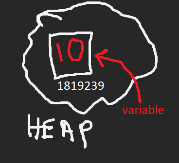
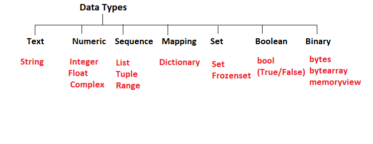

# Python Notes for OOPS and DIP

## Basics

### 👉 Comments

Comments are text that enhance the understanding of the code by explaining the reader what the program does.

-   single line comment denoted by `#`
-   multi line comments denoted by `'''`

```py
# main.py

# single line comment

'''
this is a
multi line
comment
'''

print("hello world !!")
```

### 👉 Literal Constants

any value that is explicitly declared as a constant and can't be changed is a literal constant

e.g. `a = 5`, `n = 1.23`, `s = "literal constant"`

### 👉 Escape Sequences

In python, strings are declared using the **double** or **single** quotes. If needed to specify the single quote `'` within the string, then it would raise an error as python interpreter won't be able to differentiate the string starts and ends.
To overcome such needs, **escape sequences** are used using the '\'.

e.g. `s = 'What\'s your name ? `

### 👉 Raw Strings

sometimes there is a need to specify some strings without any special processing such as _escape sequences_. At times **raw string** is what we need. Raw string declared by prefexing `r` or `R` to a string

eg. `r"Newlines are indicated by \n"`

> An use case for raw strings --> regular expressions

### 👉 f-string

In python, to display any variable in the output string at a specific position, `format` method is used.

e.g `print("My name is {}".format(name))`
where the variable `name` holds a value

The parameter i.e `{}` can be named or given a postional value which corresponds to the value the format method will refer.

```py

name = "sroy"
age = 20

print("Name is {0} and age is {1}".format(name, age))
print("Name is {0} and age is {1}".format(age, name))
print("Name is {name} and age is {age}".format(name=name, age=age))

# print('Name is sroy and age is 20')
# print('Name is 20 and age is sroy')
# print('Name is sroy and age is 20')
```

In python, the named parameter can be written using a shorter syntactical sugar, called **f-string**. `f` or `F` can be used

```py
name = "sroy"
age = 20

print(f"Name is {name} and age is {age}")
```

### 👉 Variables

In programming, we process data like numbers, texts, booleans, etc. To do so, these data need to be stored in some container in the memory for accessing and using them. Such containers that hold some data are known as **variable**. As the name suggested, they hold variety of data in the program based on the requirements of the program



`A variable can't be only declared without initialization in python`

### 👉 Identifier

Now, these memory blocks (**variables**) need to be referred in order to use them. Identifiers are names given to such variables like objects in the memory to identify them in the program.

-   every object in the memory has a memory location address (like 1819239)
-   but this address is not very suitable to identify the value `10`
-   hence a name is assigned that indicates the memory location, thus called identifier

eg. `val = 10`

```py
# main.py

val = 10

print(id(val))      # 1819239
```

### 👉 Data types

A variety of data is used within a program like numbers, text, boolean values, etc.
In Python, **8** different data types are possible

1. Integer
2. Float
3. Complex
4. Boolean
5. List
6. Set
7. Dictionary
8. String



```py
# Number
#   --> integer
#   --> float (real number)
#   --> complex

n1 = 10         # int
n2 = 10.23      # float
n3 = 2 + 5j     # complex

print(type(n1))
print(type(n2))
print(type(n3))

x = int(20.23)
x = float('23')
x = complex(2, 4)

```

```py
# Boolean
#   --> True
#   --> False

a = 4
b = 5
c = True

print(type(c))

c = bool(1)

c = int(a < b)

```

```py
# Strings

name = "sroy"
char = 'S'  # though character but treated as strings
lang = "PYTHON"

print(type(char))
```

```py
# List

lst1 = [1, 2, 3]
lst2 = ["python", 20, True]
print(type(lst2))

# Tuple

tp1 = (1, 2, 3)
tp2 = ("python", 20, False)
print(type(tp2))

# Set

st1 = {10, 4, 1, 2, 2, 3}  # no dupicates
print(type(st1))

# Dictionary

dct1 = dict([("age", 20), ("name", "sroy")])
dct2 = {
    "lang": "python",
    "dob_year": 1994,
    "age": 30
}

dct1["loggedIn"] = True
print(type(dct2))

```

advanced data types like:

-   iterable
-   range
-   objects
-   arrays
-   heap
-   stack
-   queues

### 👉 Operators

1. **Assignment**
1. **Arithmetic**
1. **Logical**
1. **Comparison**
1. **Identity**
1. **Membership**
1. **Bitwise**
1. **Unary**
1. **Left shift**
1. **Right shift**

```py
# Operators

# Assignment (=)
a = 10
name = "python"
print(f"{a}, {name}")

# Arithmetic (+, -, *, /, %, //, **)
a = 3
b = 2

add = a + b
sub = a - b
mul = a * b
div = a / b     # float division
mod = a % b
quo = a // b    # integer division
exp = a ** b


# Logical (and, or, not)
r1 = a < 5 and b > 3
r2 = a < 5 or b > 3

# Comparison (==, !=, >, >=, <, <=)
r3 = a < 5
r4 = int(a == 10)

# Identity (is, is not)
r5 = a is not r3
r6 = b is 2

# Membership (in, not in)
lst1 = [1, 2, 3, 4, 5]
tp1 = ("sroy", 20, False)
r7 = 10 in lst1
r8 = 5 in lst1
r9 = "sroy" not in tp1

# Unary (+=, -=, *=, /=, //=)
a = 3
b = 2

a += 2
b *= 1

# Bitwise
'''
    bitwise and - &
    bitwise or - |
    bitwise xor - ^
    bitwise invert - ~
'''
r10 = ~0
r11 = 0b1 & 0b1
r12 = 2 | 1
r13 = bin(0b10 | 0b01)
r14 = 2 ^ 3

# Shift (>> means /2, << means x2)
r15 = 10 >> 1
r16 = 3 << 2

```

### 👉 Number System Conversion

Number system categorized majorly into 4 groups based on the base of numbers i.e

1. **Binary** (base 2)
2. **Octal** (base 8)
3. **Decimal** (base 10)
4. **Hexadecimal** (base 16)

```py
a = 10              # integer
bin_a = bin(a)      # 0b1010, 0b denotes it's binary
oct_a = oct(a)      # 0o12, 0o denotes octal
hex_a = hex(a)      # 0xa, 0x denotes hexadecimal

b = 0b1100
print(int(b))       # 12
```

### 👉 swapping two variables

In programming, **swap** is a widely used topic in several cases. It can be done in _two_ ways:

1. Using **third** variable

```py
a = 5
b = 6

c = a
a = b
b = c
```

2. Without using **third** variable

```py
a = 5
b = 6

# using arithmetic operation
a = a + b
b = a - b
a = a - b

# using bitwise XOR operation
a = a ^ b
b = a ^ b
a = a ^ b

```

In python, swapping can be done in a very unique way called **rotate two**.

The values are loaded in a stack, then the top two values are rotated thus the right side of the expression is executed and then the values are assigned to the variables on the left hand side of the expression

```py
a = 5
b = 6

a, b = b, a     # its a assignment operation after rotation

# output
# a = 5
# b = 6

# (a, b) = (6, 5)
```

**Control flow statements include loops and conditionals**

### 👉 Loops

to iterate some statements or a block of code multiple times, loops are used. It maintains the `DRY (do not repeat yourself)` concept

-   for in loop

```py

nums = [1, 2, 10, 3, 4]
nums2 = {1, 2, 4, 10, 3, 4}
langs = ["python", "java", "javascript"]

for i in range(len(nums)):
    print(i, "=>", nums[i])
# 0 => 1, 1 => 2 ..

for e in nums:
    print(e)
# 1, 2 ...

# enumerate() adds a counter to an iterable
for i, val in enumerate(langs):
    print(i, val)
# 0 python, 1 java ..


search = 4
for i,n in enumerate(nums2):
    if n == search:
        print(f"found at {i}")
        break
else:
    print("not found")
# 'found at 3'


```

-   while loop

```py

# while loop

i = 1
s = 0
while i <= 10:
    s += i
    if s >= 30:
        s -= i
        break
    i += 1

print(f"sum of 1st 10 natural numbers: {s}")
print(f"sum of 1st 10 natural numbers less than 30: {s}")
```

### 👉 Array

An array is a linear data structure consists of data of similar data type, unlike Lists

In python, arrays are not predefined hence a module named `array` can be used.

The `array.array()` class constructor takes two arguments - **typecode** and **array of initializer** where this type code indicates what type of array has to be created

| Type code |      C Type       | Minimum size in bytes |
| :-------: | :---------------: | :-------------------: |
|    'b'    |  signed integer   |           1           |
|    'B'    | unsigned integer  |           1           |
|    'u'    | Unicode character |           2           |
|    'h'    |  signed integer   |           2           |
|    'H'    | unsigned integer  |           2           |
|    'i'    |  signed integer   |           2           |
|    'I'    | unsigned integer  |           2           |
|    'l'    |  signed integer   |           4           |
|    'L'    | unsigned integer  |           4           |
|    'q'    |  signed integer   |           8           |
|    'Q'    | unsigned integer  |           8           |
|    'f'    |  floating point   |           4           |
|    'd'    |  floating point   |           8           |

**_Methods_**:

append() -- append a new item to the end of the array

buffer_info() -- return information giving the current memory info
byteswap() -- byteswap all the items of the array
count() -- return number of occurrences of an object
extend() -- extend array by appending multiple elements from an iterable
fromfile() -- read items from a file object
fromlist() -- append items from the list
frombytes() -- append items from the string
index() -- return index of first occurrence of an object
insert() -- insert a new item into the array at a provided position
pop() -- remove and return item (default last)
remove() -- remove first occurrence of an object
reverse() -- reverse the order of the items in the array
tofile() -- write all items to a file object
tolist() -- return the array converted to an ordinary list
tobytes() -- return the array converted to a string

### 👉 🌟🌟 Memory size of a variable

-   to check memory size, `getsizeof()` from `sys` library is used

```py

from sys import getsizeof
a = 10

print(getsizeof(a), "bytes")     # 28 bytes
```

-   from the above code it is clear that an integer variable takes 28 bytes in an x64 machine and not _4 bytes_. this is because here the size of the integer is the size of the object of integer class and a class get some overhead with different methods and other functionalities

### 👉 Searching Array

-   linear search
-   binary search

```py

from array import array

lst = [9, 2, 4, 3, 5, 8, 7, 1, 6, 10]

arr = array("I", lst)

to_search = 3

# LINEAR SEARCH
# =============

flag = 0
for e in arr:
  if e == to_search:
      flag = 1
      res = f"found at {arr.index(e)} index"
      break
else:
  res = "not found"


# BINARY SEARCH
# =============
new_arr = sorted(arr)
low = 0
high = len(arr) - 1
while low < high:
    mid = (low + high) // 2

    if to_search == new_arr[mid]:
        r = "found"
        break
    elif to_search > new_arr[mid]:
        low = mid + 1
    else:
        high = mid

else:
    r = "not found"

```

> with user input array

```py

from array import array

arr = array("I", [])

n = int(input("Size of array? "))

for i in range(n):
    arr.append(int(input()))

to_search = int(input("Search element? "))
new_arr = sorted(arr)
low = 0
high = len(arr) - 1

while low < high:
    mid = (low + high) // 2

    if to_search == new_arr[mid]:
        r = "found"
        break
    elif to_search > new_arr[mid]:
        low = mid + 1
    else:
        high = mid

else:
    r = "not found"

print(r)

```

### 👉 Functions

Reusable blocks of program.

```py

def sayHello(name):
    print("hello, {name}".format(name=name))


def add(a, **args):
    print(a)
    z = '' in args


# sayHello('')
# sayHello("theonlysroy")

# add(10, two=2, three=3, four = 4)


```

**types of parameters : **

1. Positional

the actual parameters should match the positions of the formal parameters of the function

2. Keyword

the actual parameters are referred by the corresponding keywords of the function arguments

3. Default

the arguments of the function are assigned a default value while defining the function; thus the parameter becomes optional while calling the function

4. Variable Length

the length of the parameter becomes variable using `**kwargs` in the argument list

### 👉 Global keyword

In a program, there is `global` and a `local` scope of variables. **Global scope** variables are accessible from anywhere in the program, whereas the **local scope** variables are confined to the local block scope of the loops or conditionals

```py

# global scope a
a = 10

def foo():
    b = 5   # local scope
    a = 6   # local scope a

    # if wanted to change global scope 'a'
    # global a
    # a += 1
    print("within fn: ", a)

foo()

print("outside fn: ", a)

```

### 👉 List

-   A data structure that holds an ordered collection of items
-   built-in `mutable` sequence
-   mixed data type values unline _arrays_
-   `l = [1, 2, 3, "sroy"]`
-   **methods**:

| method name                                              | function                                                                                                    |
| -------------------------------------------------------- | ----------------------------------------------------------------------------------------------------------- |
| append(self, object, /)                                  | Append object to the end of the list.                                                                       |
| clear(self, /)                                           | Remove all items from list.                                                                                 |
| copy(self, /)                                            | Return a shallow copy of the list.                                                                          |
| count(self, value, /)                                    | Return number of occurrences of value.                                                                      |
| extend(self, iterable, /)                                | Extend list by appending elements from the iterable.                                                        |
| index(self, value, start=0, stop=9223372036854775807, /) | Return first index of value.Raises ValueError if the value is not present.                                  |
| insert(self, index, object, /)                           | Insert object before index.                                                                                 |
| pop(self, index=-1, /)                                   | Remove and return item at index (default last).Raises IndexError if list is empty or index is out of range. |
| remove(self, value, /)                                   | Remove first occurrence of value. Raises ValueError if the value is not present.                            |
| reverse(self, /)                                         | Reverse _IN PLACE_.                                                                                         |
| sort(self, /, \* , key=None, reverse=False)              | Sort the list in ascending order and return None.                                                           |

### 👉 Tuple

-   built-in `immutable` sequence
-   `t = (1, 2, "python")`
-   mostly used when data from a **database** is received

### 👉 Dictionary

-   `key-value` pair mapping
-   _immutable_ objects (like strings) for key
-   either _mutable_ or _immutable_ objects for the values
-   curly braces notation
-   `d = {key1: value1, key2: value2}`

### 👉 Set

-   built-in unordered collection of data
-   `unique` elements (just like set in Maths)
-   `st1 = set([1, 2, 4])`

### 👉 Decorators

-   In Python, functions are **first class objects** i.e. they can be used or passed as parameters
-   decorators allow to extend / add extra functionalities to an existing function
-   a wrapper function wraps the existing function (treated as _inner function_) and extend behaviour of the wrapped function

```py

def div(a, b):
    if b == 0:
        return "zero division"
    return (a / b)


def smart_div(func):

    def inner(a, b):
        if a < b:
            a, b = b, a

        return func(a, b)

    return inner


div = smart_div(div)

# div(2, 10)
```

# program

```py

import os
import time

source = ["../notes"]

target = "E:\\Backup"

if not os.path.exists(target):
    os.mkdir(target)

today = target + os.sep + time.strftime('%Y%m%d')
now = time.strftime('%H%M%S')

file = today + os.sep + now + '.zip'

if not os.path.exists(today):
    os.mkdir(today)
    print(f"Successfully created directory {today}")

cmd = 'zip -r {0} {1}'.format(file, ' '.join(source))

print("cmd is: ")
print(cmd)
print("Running...")
if os.system(cmd) == 0:
    print(f"Successfully backup to {file}")
else:
    print("Backup FAILED")

```

### 👉 Classes & Objects

```py

class Circle:

    def __init__(self, r=1):
        self.radius = r

    def area(self):
        return (3.14 * (self.radius**2))

    def __str__(self):
        return f"Circle with Radius: {self.radius}"


c1 = Circle(2)
print(c1.area())
print(c1.__str__())
```

```py


class Rectangle:

    def __init__(self, l, b):
        self.length = l
        self.width = b

    def area(obj):
        return (obj.length * obj.width)


r1 = Rectangle(2, 10)
r2 = Rectangle(4, 23)

print(r1.area())
print(r2.area())

```

### 👉 Constructor

### 👉 _self_ keyword

### 👉 Class Variables

### 👉 Instance Variables

### 👉 Class methods

### 👉 Instance methods

### 👉 Static methods

### 👉 Accessors & Mutators

### 👉 Inheritance

### 👉 Polymorphism

### 👉 Duck Typing

### 👉 Operator Overloading

### 👉 Method Overloading

### 👉 Method Overriding

### 👉 Abstract Classes & methods

```py

from abc import ABC, abstractmethod

class Shape(ABC):

    def __init__(self):
        pass

    @abstractmethod
    def area(self):
        return 0

class Square(Shape):

    def __init__(self, l):
        self.length = l

    def area(self):
        return self.length

sq1 = Square(10)
z = sq1.area()

```

### 👉 _super()_

### 👉 File handling

### 👉 Database Connectivity

### 👉 Lambda expression

### 👉 Solved Problems from github

### 👉 Exception Handling

```py

def throws():
    return 5/0

try:
    throws()
except Exception as e:
    res = f"{e.__str__}"


# e.args
# type(e)
# e.__str__
```

---

[Python 100 Questions](https://github.com/zhiwehu/Python-programming-exercises/blob/master/100+%20Python%20challenging%20programming%20exercises%20for%20Python%203.md#level-1beginner)

```py
# Q = sqrt([(2 * C * D) / H])
# C = 50, H = 30
# D = 100,150,180

from math import sqrt


def findVal(D):
    C = 50
    H = 30
    q = round(sqrt((2 * C * D) / H))
    return q


d = "100,150,180"

# d = input("enter comma seperated values: ")

d = [int(x) for x in d.split(",")]

res = ','.join([str(findVal(x)) for x in d])

print(res)

'''
# arr[x][y] x=3, y=5

inp = "3,5"
row, col = (int(x) for x in inp.split(','))

# arr2 = [[i * j for i in range(col)] for j in range(row)]

arr = [[] for i in range(row)]
for i in range(row):
    for j in range(col):
        arr[i].append(i*j)

print(arr)
'''
# -------

'''
inp = "without, hello ,bag, world"

words = [x.strip() for x in inp.split(',')]
words.sort()
res = ','.join(words)
'''

# ------

# inp = "Hello world\nPractice makes perfect"
# lines = inp.split('\n')

# out = [x.upper() for x in lines]
# res = ' '.join(out)

# -------

# inp = "hello world and practice makes perfect and hello world again"
# words = set(inp.split())
# res = ' '.join(sorted(words))

# -------------

'''
from math import pow


def binToDec(n):
    n = n[::-1]
    cnt = 0
    s = 0
    for i in n:
        s += int(int(i) * pow(2, cnt))
        cnt += 1
    return s


inp = "0100, 0011, 1010, 1001"

data = [int(x.strip(), 2) for x in inp.split(",")]

# data = [binToDec(x.strip()) for x in inp.split(',')]

res = [str(e) for e in filter(lambda x: x % 5 == 0, data)]
r = ''.join(res)

'''

# --------

# inp = "hello! 123457"

# letters = [chr(x) for x in range(97,123)]
# digits = [str(x) for x in range(10)]

# res = {"LETTERS": 0, "DIGITS": 0}

# for e in inp:
#   if e.lower() in letters:
#       res["LETTERS"] += 1
#   elif e in digits:
#       res["DIGITS"] += 1
#   else:
#       pass

# print(f"LETTERS {res["LETTERS"]} DIGITS {res["DIGITS"]}")


# ----------

# s = "Hello world"
# res = {"UPPER": 0, "LOWER": 0}
# for e in s:
#   if e.isupper():
#       res["UPPER"] += 1
#   elif e.islower():
#       res["LOWER"] +=1
#   else:
#       pass

# upper, lower = res.values()
# print(f"UPPER CASE {upper} LOWER CASE {lower}")

# -----------

# s = "9"
# n1 = int(s)
# n2 = int(s+s)
# n3 = int(s+s+s)
# n4 = int("%s%s%s%s" %(s,s,s,s))

# res = n1+n2+n3+n4

# ------------

def removeDuplicates(lst):

    new_lst = []
    for e in lst:
        if e not in new_lst:
            new_lst.append(e)

    return new_lst


lst = [12,24,35,24,88,120,155,88,120,155]

res = removeDuplicates(lst)


```
